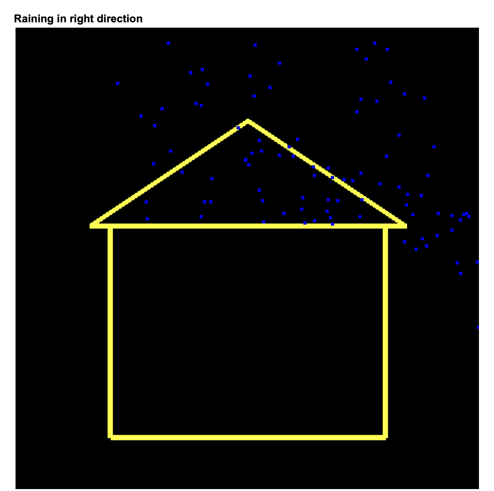
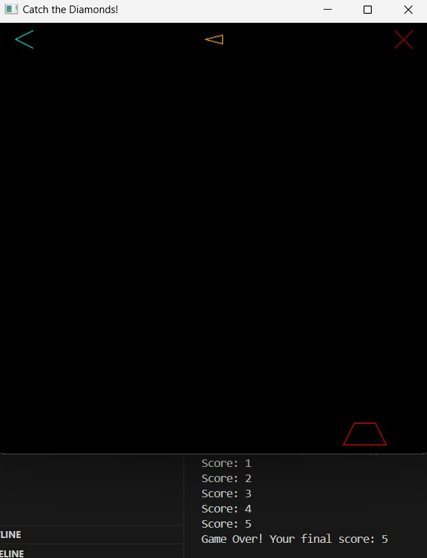

# BRACU-CSE423-COMPUTER-GRAPHICS-Summer24

## Lab 1

  
   
   
  Figure 1: Rain Simulation Controls

**TASK 1 - Rain Simulation Controls**
- **Normal raining** (default state).  
- **Directional Rain**:
  - Left arrow (`←`): Rain falls in the left direction.  
  - Right arrow (`→`): Rain falls in the right direction.  
- **Morning Rain**:
  - Press `M`: Rain in the morning (adjust lighting/colors).  
- **Day/Night Toggle**:
  - A button to switch between day and night mode.  

**TASK 2 - Star Blinking and Speed Control**
- **Blinking Start** 
- **Speed Control**:
  - **Increase speed**.  
  - **Decrease speed**.  
  - **Pause button** (stops the rain animation).  

## Lab2
**Task Features for Your OpenGL Game (Catch the Diamonds)**  

  
   
   
  Figure 1: Catch the Diamonds

#### **1. Basic Gameplay**  
- A **diamond** falls from the top of the screen.  
- A **catcher** at the bottom moves left/right to catch the diamond.  
- If the catcher catches the diamond, the **score increases**.  
- If the diamond reaches the bottom without being caught, **game over** is triggered.  

#### **2. Speed Mechanics**  
- The **diamond speed increases** gradually over time.  
- The difficulty increases as the player catches more diamonds.  

#### **3. Game States**  
- **Paused State**:
  - The game can be paused and resumed using the **Play/Pause button**.  
- **Game Over State**:
  - When the player misses a diamond, the game ends and shows the final score.  

#### **4. Interactive UI Buttons**  
- **Restart Button**: Resets the game, score, and speed.  
- **Play/Pause Button**: Toggles between running and paused state.  
- **Exit Button**: Exits the game.  

#### **5. Visual Features**  
- **Random Diamond Colors**: Each falling diamond has a random color.  
- **Catcher Color Changes**:
  - Turns **red** when the game is over.  
- **Buttons are Color-Coded**:
  - **Restart (Cyan)**  
  - **Play/Pause (Orange)**  
  - **Exit (Red)**  

#### **6. Collision Detection**  
- Checks if the catcher and diamond collide to determine if the player scores.  

## Task3

Your game is a simple 2D shooting game built with OpenGL, where the player controls a shooter at the bottom of the screen. The objective is to shoot down incoming enemies before they reach the bottom.  

- **Shooter:** The player moves the shooter left and right to align with enemies.  
- **Bullets:** The shooter can fire bullets upwards, which continue moving until they hit an enemy or go off-screen.  
- **Enemies:** Enemies spawn at the top and move downwards. If they reach the bottom, the game might end or reduce the player's score.  
- **Collision System:** When a bullet hits an enemy, the enemy disappears, likely increasing the score.  
- **Controls:** The player can move the shooter, fire bullets, and possibly pause or restart the game.  

